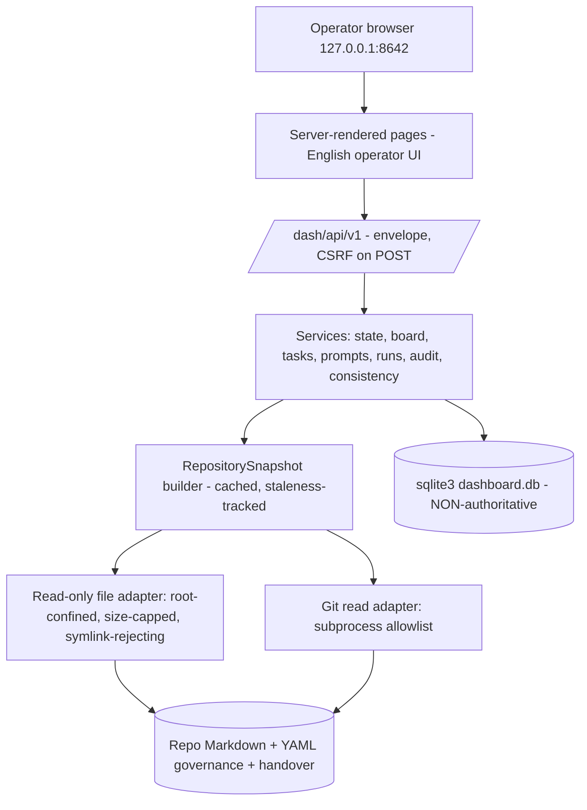
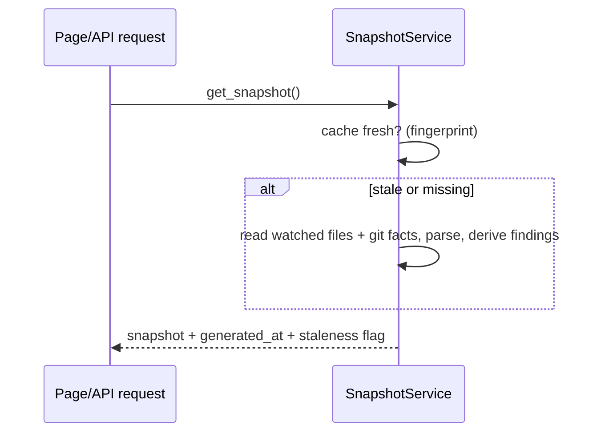
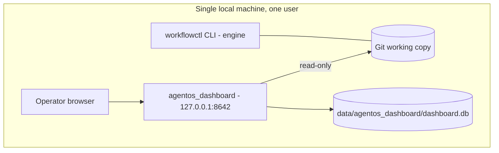

# AgentOS Dashboard — Architecture

| Field | Value |
|---|---|
| **Title** | AgentOS Dashboard — Architecture |
| **Purpose** | Normative technical architecture of the dashboard: component model, adapter contracts, technology selections, deployment topology, and rejected alternatives. |
| **Status** | Draft |
| **Version** | 1.0 |
| **Owner** | Dashboard implementation session (maintainer) · Human Owner via independent review (approval) |
| **Dependencies** | `MASTER_PLAN.md` §3; `DECISIONS.md` DD-01, DD-03 |
| **Related Documents** | `SECURITY_MODEL.md`, `SOURCE_OF_TRUTH.md`, `docs/architecture.md` (engine architecture) |

## Table of Contents
1. Context and Constraints · 2. Component Model · 3. Adapter Contracts · 4. Snapshot Data Flow ·
5. Deployment Topology · 6. Technology Selections · 7. Non-Goals · 8. Rejected Options ·
9. Decision References · 10. Open Questions · 11. Future Revisions

## 1. Context and Constraints

The dashboard is a separate local control-plane application (`DD-01`, Option 2) living in the
same repository as the `ai-workflow-engine` engine package. Binding constraints:

- Local-only, single-user, loopback-bound; conservative, read-only-first, human-controlled.
- Zero modification of `src/`, `tests/`, `scripts/`, `pyproject.toml`,
  `.pre-commit-config.yaml`, `self-governance.yaml`, `docs/implementation/orchestration/**`,
  or any engine behavior.
- Minimal dependencies: reuse the stack already pinned in `pyproject.toml` (Pydantic, PyYAML;
  pytest from the `dev` extra) inside the `ai-workflow-engine` Conda environment
  (`self-governance.yaml` `conda_environment`). The repository pins **no web framework**; the
  HTTP-serving selection is gated on OD-D9 (`OPEN_QUESTIONS.md`) and must be approved by the
  Human Owner before DASH-004. DASH-002/DASH-003 use only the stdlib and existing dependencies.
- Authoritative state remains Markdown + YAML + Git (`SOURCE_OF_TRUTH.md`); the dashboard's own
  persistence is non-authoritative.
- The audited engine test collection (`pytest` with `testpaths=["tests"]`) must remain
  provably unchanged; dashboard tests live in `agentos_dashboard/tests/`.

## 2. Component Model

Package layout: `agentos_dashboard/{__main__.py, main.py, settings.py, core/, parsing/,
services/, storage/, api/, web/, prompt_templates/, tests/}`.

The two adapters (`core/files.py`, `core/gitread.py`) are the only code permitted to touch the
repository. Parsing (`parsing/`) turns adapter output into typed, confidence-scored views.
Services compose views into page/API responses. Storage (`storage/`) owns the local database
described in `DATA_MODEL.md`.

## 3. Adapter Contracts

**File adapter** — every access resolves `(root / rel).resolve()` and must satisfy
`is_relative_to(root)`; symlinks resolving outside the root are rejected; deny-list: `.env*`
(defensive; none is expected in this repository), `data/agentos_dashboard/**` (the dashboard's
own local store is never part of a snapshot), `.git/**` (except via the Git adapter); per-file
read caps (default 2 MB display; head/tail views for larger); UTF-8 with error-tolerant
decoding.

**Git adapter** — named functions over `subprocess.run` with fixed argv only:
`status --porcelain=v2 --branch`, bounded `log` with fixed format, `branch -a --format`,
`tag --format`, `rev-parse`, `diff --stat <sha>..<sha>`, `diff --check`. `LC_ALL=C`; 5-second
timeout; typed errors; **no mutating verb exists in the codebase**. This mirrors the engine's
own read-only `GitClient` discipline (`src/ai_workflow_engine/git/`) without importing or
modifying it.

**Snapshot builder** — produces an immutable snapshot object keyed by a fingerprint
(watched-file mtimes + `HEAD` SHA; watched-file list in `SOURCE_OF_TRUTH.md` §3); every page
renders one coherent snapshot; staleness is surfaced, never hidden (`SOURCE_OF_TRUTH.md` TR
rules).

## 4. Snapshot Data Flow

## 5. Deployment Topology

Startup: `conda activate ai-workflow-engine && python -m agentos_dashboard`. The entry point
refuses any non-loopback bind, acquires a PID lockfile, and prints the exact URL. No reverse
proxy, LAN, or internet exposure is permitted (`SECURITY_MODEL.md`).

## 6. Technology Selections

| Concern | Selection | Rationale |
|---|---|---|
| Frontend | Server-side rendered HTML + minimal vanilla JS | Repo has no Node toolchain; templating engine per OD-D9 |
| Backend | HTTP framework **pending OD-D9** (Human Owner dependency decision) | `pyproject.toml` pins no web framework; adding one needs approval |
| API style | `{ok, data, error}` envelope at `/dash/api/v1` | Mirrors the engine's CLI contract-v2 envelope discipline |
| Markdown | Stdlib escape-first mini-renderer | OD-D2; no new dependency; smaller XSS surface |
| YAML | `PyYAML` safe loading, duplicate-key rejecting | Already pinned; mirrors the engine's hardened loader posture |
| Git layer | Subprocess allowlist | Mirrors the engine's read-only `GitClient` idiom; no GitPython |
| Persistence | Stdlib `sqlite3`, `PRAGMA user_version` | OD-D5; no Alembic coupling |
| Prompt templates | Markdown files with `{{placeholder}}` substitution | Tracked in `agentos_dashboard/prompt_templates/` |
| Audit/event model | Append-only table + JSONL mirror | `DATA_MODEL.md` EN-26 |
| Local auth | Loopback bind + Host allowlist + CSRF | Single trusted operator; `SECURITY_MODEL.md` |
| Live update | Manual refresh + staleness banner | No websockets/workers in MVP |
| Testing | pytest in `agentos_dashboard/tests/` | OD-D8; engine suite untouched |
| Config | `AWED_`-prefixed environment variables parsed into a Pydantic model | Pydantic already pinned; no pydantic-settings dependency |
| Logging | stderr + `data/agentos_dashboard/logs/` with redaction filter | `SECURITY_MODEL.md` SC-09 |

## 7. Non-Goals

Microservices; SPA frameworks; Node toolchain; Docker/Redis/queues/Kubernetes; remote access;
multi-user; direct agent execution; any repository write path; any change to `workflowctl` or
the orchestration package.

## 8. Rejected Options

- **Option 1 — embed in the engine package** (`src/ai_workflow_engine/`): rejected — couples an
  HTTP surface and its dependencies into a deliberately lean, strictly-typed CLI engine,
  contaminates the audited engine test suite and mypy/ruff gates, and puts UI failures in the
  same failure domain as the governance gates the dashboard is supposed to observe.
- **Option 3 — separate service + independent SPA frontend**: rejected — requires a Node
  toolchain absent from the repository, enlarges the security surface (CORS, second build
  system), exceeds MVP need.

## 9. Decision References
DD-01 (Option 2); DD-03 (repository adaptation); `docs/DECISION_LOG.md` 2026-07-23 entry.

## 10. Open Questions
OD-D2, OD-D3, OD-D4, OD-D5 (dispositions in `OPEN_QUESTIONS.md`); OD-D9 (**open** — web
framework).

## 11. Future Revisions
Safe direct agent integration and write-back designs require a new decision (`MASTER_PLAN.md` §12).
